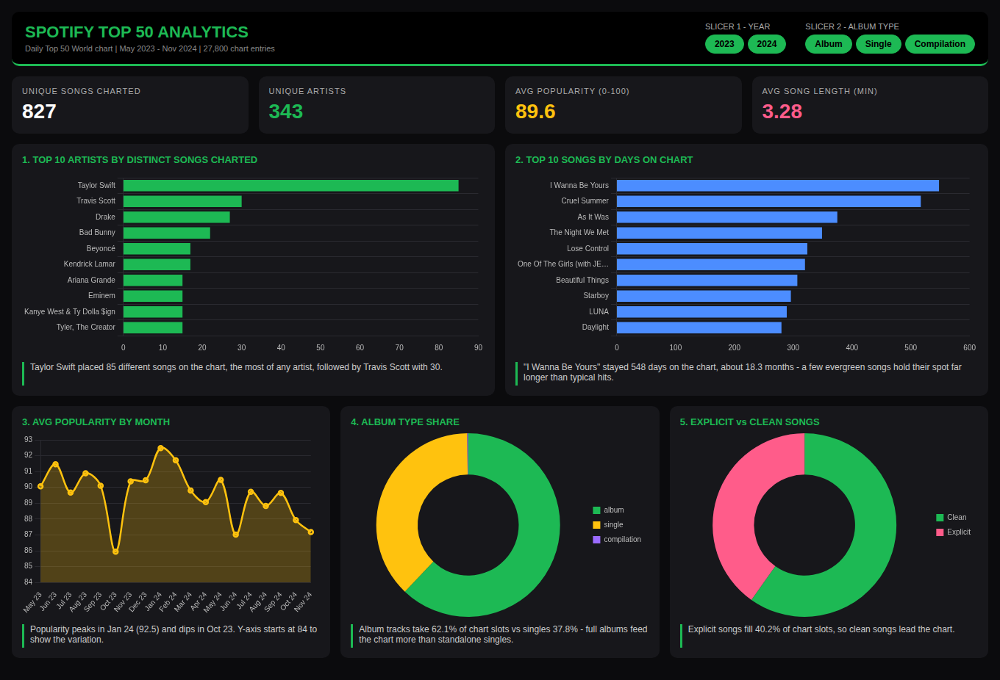

# Spotify Top 50 Analytics Dashboard

An interactive dashboard (4 KPIs, 5 charts, 2 slicers) analysing the Spotify Daily Top 50 World chart from May 2023 to Nov 2024 (27,800 chart entries, 827 unique songs, 343 artists).

**Live demo:** https://akashnikam5847.github.io/spotify-analytics-dashboard/

## Dataset
`spotify-top-50-world.csv`: 27,800 rows, 11 columns (date, position, song, artist, popularity, duration, album type, total tracks, release date, explicit flag). No missing values. Each row is one song's position on one day, so "days on chart" counts chart appearances.

## Dashboard
- **KPIs:** unique songs charted, unique artists, average popularity, average song length
- **Slicers:** year, album type
- **Charts:** top 10 artists by distinct songs, top 10 songs by days on chart, average popularity by month, album type share, explicit vs clean songs
- Every chart has an insight line that updates with the slicers

## Key insights
- Taylor Swift placed 85 different songs on the chart, far more than #2 Travis Scott (30)
- "I Wanna Be Yours" stayed 548 days on the chart
- Albums take 62.1% of chart slots vs singles 37.8%
- Average popularity is 89.6 and the average song is 3.28 minutes long
- Explicit songs fill 40.2% of chart slots, clean songs lead

## Tools
Python (pandas) for aggregation, HTML/JavaScript, Chart.js

## Screenshot

